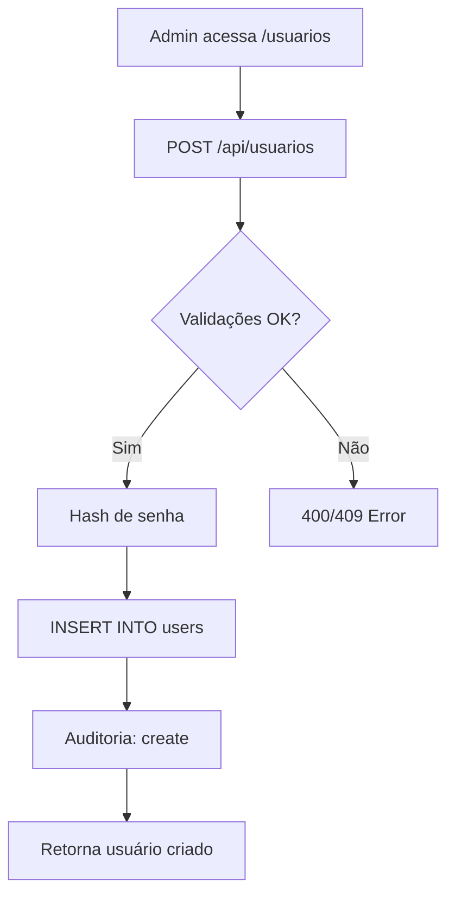
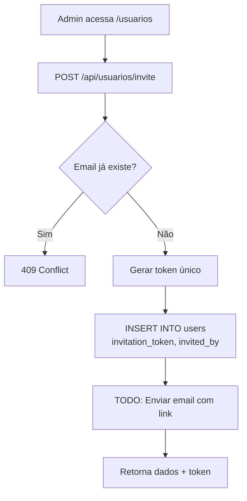
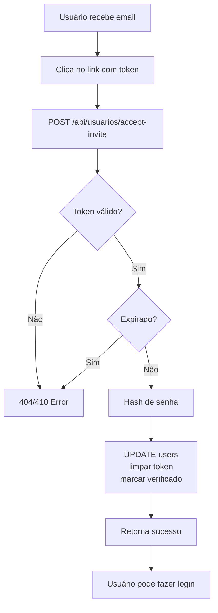
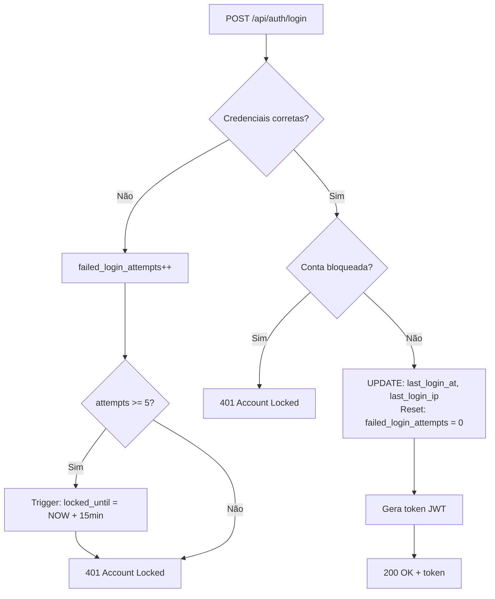

# RF10 - Gerenciamento de Usuários - Documentação Completa

## 📋 Visão Geral

O **RF10 (Gerenciamento de Usuários)** implementa um sistema completo de administração de usuários com recursos avançados de segurança, convite por email, rastreamento de atividades e métricas detalhadas.

### Objetivos

1. **CRUD Completo**: Criar, listar, atualizar e deletar (soft delete) usuários
2. **Sistema de Convites**: Convidar novos usuários com tokens temporários
3. **Segurança**: Bloqueio automático de contas após tentativas de login, rastreamento de IPs
4. **Verificação de Email**: Workflow de verificação com timestamps
5. **Métricas**: Dashboard com 17 KPIs e 7 views analíticas
6. **Auditoria**: Rastreamento completo de ações (quem convidou quem, últimos logins, etc)

---

## 🗄️ Estrutura de Banco de Dados

### Migration 024: Melhorias na Tabela `users`

Adiciona **14 novas colunas** à tabela existente:

```sql
-- Contato e Organização
phone                   VARCHAR(20)        -- Telefone de contato
department              VARCHAR(100)       -- Departamento
job_title               VARCHAR(150)       -- Cargo (substitui cargo)

-- Rastreamento de Login
last_login_at           TIMESTAMP          -- Último login
last_login_ip           VARCHAR(45)        -- IP do último login (IPv4/IPv6)

-- Segurança
failed_login_attempts   INTEGER DEFAULT 0  -- Contador de tentativas falhas
locked_until            TIMESTAMP          -- Bloqueio até (auto-set por trigger)

-- Verificação de Email
email_verified          BOOLEAN DEFAULT FALSE
email_verified_at       TIMESTAMP          -- Quando foi verificado

-- Sistema de Convites
invitation_token        VARCHAR(255)       -- Token único de convite
invitation_expires_at   TIMESTAMP          -- Expiração do convite
invited_by              UUID               -- FK → users(id)

-- Dados Adicionais
bio                     TEXT               -- Biografia/notas
preferences             JSONB DEFAULT '{}'  -- Preferências do usuário

-- Auditoria
updated_at              TIMESTAMP          -- Auto-atualizado por trigger
deleted_at              TIMESTAMP          -- Soft delete
```

#### Constraint Atualizado

```sql
role CHECK (role IN ('USER', 'RECRUITER', 'ADMIN', 'SUPER_ADMIN'))
```

#### Foreign Key

```sql
invited_by → users(id) ON DELETE SET NULL
```

#### Triggers

1. **update_users_timestamps()** - `BEFORE UPDATE`
   - Auto-atualiza `updated_at = NOW()`

2. **check_and_lock_user_account()** - `BEFORE UPDATE OF failed_login_attempts`
   - Se `failed_login_attempts >= 5`: seta `locked_until = NOW() + 15 minutes`
   - Previne brute-force attacks

#### Índices (8 novos)

```sql
idx_users_company             (company_id WHERE deleted_at IS NULL)
idx_users_email               (LOWER(email) WHERE deleted_at IS NULL)
idx_users_role                (role WHERE deleted_at IS NULL)
idx_users_is_active           (is_active WHERE deleted_at IS NULL)
idx_users_created_at          (created_at DESC WHERE deleted_at IS NULL)
idx_users_last_login          (last_login_at DESC WHERE deleted_at IS NULL)
idx_users_invitation_token    (invitation_token WHERE invitation_token IS NOT NULL AND deleted_at IS NULL)
idx_users_preferences_gin     (preferences USING GIN)
```

#### View: `active_users_overview`

```sql
SELECT u.*, c.name as company_name
FROM users u
LEFT JOIN companies c ON u.company_id = c.id
WHERE u.deleted_at IS NULL AND u.is_active = TRUE
```

---

### Migration 025: Views de Métricas

Cria **7 views** e **1 função** para analytics:

#### 1. `user_stats_overview` - Estatísticas Consolidadas (16 métricas)

```sql
SELECT
  company_id,
  COUNT(*) as total_users,
  SUM(CASE WHEN is_active THEN 1 ELSE 0 END) as active_users,
  SUM(CASE WHEN NOT is_active THEN 1 ELSE 0 END) as inactive_users,
  SUM(CASE WHEN email_verified THEN 1 ELSE 0 END) as verified_users,
  SUM(CASE WHEN NOT email_verified THEN 1 ELSE 0 END) as unverified_users,
  SUM(CASE WHEN role = 'SUPER_ADMIN' THEN 1 ELSE 0 END) as super_admin_count,
  SUM(CASE WHEN role = 'ADMIN' THEN 1 ELSE 0 END) as admin_count,
  SUM(CASE WHEN role = 'RECRUITER' THEN 1 ELSE 0 END) as recruiter_count,
  SUM(CASE WHEN role = 'USER' THEN 1 ELSE 0 END) as user_count,
  SUM(CASE WHEN locked_until IS NOT NULL AND locked_until > NOW() THEN 1 ELSE 0 END) as locked_users,
  COUNT(*) FILTER (WHERE created_at >= NOW() - INTERVAL '7 days') as users_last_7_days,
  COUNT(*) FILTER (WHERE created_at >= NOW() - INTERVAL '30 days') as users_last_30_days,
  COUNT(*) FILTER (WHERE last_login_at >= NOW() - INTERVAL '7 days') as logins_last_7_days,
  COUNT(*) FILTER (WHERE last_login_at >= NOW() - INTERVAL '30 days') as logins_last_30_days,
  SUM(CASE WHEN invitation_token IS NOT NULL AND invitation_expires_at > NOW() THEN 1 ELSE 0 END) as pending_invitations
FROM users
WHERE deleted_at IS NULL
GROUP BY company_id
```

#### 2. `users_by_role` - Distribuição por Role

```sql
SELECT
  company_id,
  role,
  COUNT(*) as user_count,
  SUM(CASE WHEN is_active THEN 1 ELSE 0 END) as active_count,
  SUM(CASE WHEN email_verified THEN 1 ELSE 0 END) as verified_count,
  MAX(last_login_at) as most_recent_login
FROM users
WHERE deleted_at IS NULL
GROUP BY company_id, role
```

#### 3. `users_by_department` - Distribuição por Departamento

```sql
SELECT
  company_id,
  COALESCE(department, 'Não definido') as department,
  COUNT(*) as user_count,
  SUM(CASE WHEN is_active THEN 1 ELSE 0 END) as active_count
FROM users
WHERE deleted_at IS NULL
GROUP BY company_id, department
```

#### 4. `user_login_timeline` - Timeline de Logins Diários

```sql
SELECT
  company_id,
  DATE(last_login_at) as login_date,
  COUNT(DISTINCT id) as unique_users_logged,
  COUNT(*) as total_logins
FROM users
WHERE deleted_at IS NULL AND last_login_at IS NOT NULL
GROUP BY company_id, DATE(last_login_at)
```

#### 5. `user_registration_timeline` - Timeline de Registros Diários

```sql
SELECT
  company_id,
  DATE(created_at) as registration_date,
  COUNT(*) as users_registered,
  SUM(CASE WHEN is_active THEN 1 ELSE 0 END) as active_registered,
  SUM(CASE WHEN email_verified THEN 1 ELSE 0 END) as verified_registered
FROM users
WHERE deleted_at IS NULL
GROUP BY company_id, DATE(created_at)
```

#### 6. `user_security_stats` - Estatísticas de Segurança (7 métricas)

```sql
SELECT
  company_id,
  COUNT(*) as total_users,
  SUM(CASE WHEN failed_login_attempts > 0 THEN 1 ELSE 0 END) as users_with_failed_attempts,
  SUM(CASE WHEN locked_until IS NOT NULL AND locked_until > NOW() THEN 1 ELSE 0 END) as currently_locked,
  AVG(failed_login_attempts) as avg_failed_attempts,
  MAX(failed_login_attempts) as max_failed_attempts,
  SUM(CASE WHEN NOT email_verified THEN 1 ELSE 0 END) as unverified_emails,
  ROUND((SUM(CASE WHEN NOT email_verified THEN 1 ELSE 0 END)::NUMERIC / NULLIF(COUNT(*), 0)) * 100, 2) as unverified_percentage
FROM users
WHERE deleted_at IS NULL
GROUP BY company_id
```

#### 7. `user_invitation_stats` - Estatísticas de Convites (4 métricas)

```sql
SELECT
  company_id,
  COUNT(*) FILTER (WHERE invited_by IS NOT NULL) as total_invitations,
  COUNT(*) FILTER (WHERE invitation_token IS NOT NULL AND invitation_expires_at > NOW()) as pending_invitations,
  COUNT(*) FILTER (WHERE invitation_token IS NOT NULL AND invitation_expires_at <= NOW()) as expired_invitations,
  COUNT(*) FILTER (WHERE invited_by IS NOT NULL AND invitation_token IS NULL) as accepted_invitations
FROM users
WHERE deleted_at IS NULL
GROUP BY company_id
```

#### Função: `get_user_metrics(company_id UUID)`

Retorna JSON com **17 KPIs**:

```json
{
  "total_users": 0,
  "active_users": 0,
  "inactive_users": 0,
  "verified_users": 0,
  "unverified_users": 0,
  "super_admin_count": 0,
  "admin_count": 0,
  "recruiter_count": 0,
  "user_count": 0,
  "locked_users": 0,
  "users_last_7_days": 0,
  "users_last_30_days": 0,
  "logins_last_7_days": 0,
  "logins_last_30_days": 0,
  "pending_invitations": 0,
  "active_rate": 0.00,        // (active_users / total_users) * 100
  "verification_rate": 0.00   // (verified_users / total_users) * 100
}
```

---

## 🔌 API Endpoints

### Base URL: `/api/usuarios`

### 1. **POST /api/usuarios** - Criar Usuário Diretamente

Cria usuário com senha imediata (sem convite).

**Requer:** ADMIN ou SUPER_ADMIN

**Body:**
```json
{
  "full_name": "João Silva",
  "email": "joao.silva@example.com",
  "password": "senha123",
  "role": "USER",
  "phone": "+55 11 98765-4321",
  "department": "Tecnologia",
  "job_title": "Desenvolvedor",
  "bio": "5 anos de experiência em Node.js",
  "is_active": true,
  "email_verified": false,
  "company": {
    "type": "CNPJ",
    "document": "12345678000199",
    "name": "Empresa XYZ"
  }
}
```

**Response 201:**
```json
{
  "id": "uuid",
  "company_id": "uuid",
  "full_name": "João Silva",
  "email": "joao.silva@example.com",
  "role": "USER",
  "phone": "+55 11 98765-4321",
  "department": "Tecnologia",
  "job_title": "Desenvolvedor",
  "bio": "5 anos de experiência em Node.js",
  "is_active": true,
  "email_verified": false,
  "created_at": "2025-11-22T12:00:00.000Z"
}
```

**Erros:**
- `400` - Campos obrigatórios faltando
- `400` - Role inválido
- `409` - Email já existe

---

### 2. **POST /api/usuarios/invite** - Convidar Novo Usuário

Cria usuário com convite pendente (token temporário).

**Requer:** ADMIN ou SUPER_ADMIN

**Body:**
```json
{
  "full_name": "Pedro Oliveira",
  "email": "pedro.oliveira@example.com",
  "role": "USER",
  "phone": "+55 11 91234-5678",
  "department": "Vendas",
  "job_title": "Analista de Vendas",
  "expires_in_days": 7
}
```

**Response 201:**
```json
{
  "id": "uuid",
  "company_id": "uuid",
  "full_name": "Pedro Oliveira",
  "email": "pedro.oliveira@example.com",
  "role": "USER",
  "phone": "+55 11 91234-5678",
  "department": "Vendas",
  "job_title": "Analista de Vendas",
  "invitation_token": "a1b2c3d4e5f6...",
  "invitation_expires_at": "2025-11-29T12:00:00.000Z",
  "invited_by": "uuid-do-admin",
  "created_at": "2025-11-22T12:00:00.000Z",
  "message": "Invitation sent successfully"
}
```

**Erros:**
- `400` - Campos obrigatórios faltando
- `409` - Email já existe

**TODO:** Integração com serviço de email para enviar link de convite.

---

### 3. **POST /api/usuarios/accept-invite** - Aceitar Convite

Aceita convite e define senha. **Rota pública** (não requer autenticação).

**Body:**
```json
{
  "invitation_token": "a1b2c3d4e5f6...",
  "password": "novaSenha123",
  "preferences": {
    "language": "pt-BR",
    "theme": "dark",
    "notifications": {
      "email": true,
      "push": false
    }
  }
}
```

**Response 200:**
```json
{
  "message": "Invitation accepted successfully",
  "user": {
    "id": "uuid",
    "full_name": "Pedro Oliveira",
    "email": "pedro.oliveira@example.com"
  }
}
```

**Erros:**
- `400` - Token ou senha faltando
- `404` - Token inválido
- `410` - Convite expirado

**Alterações no banco:**
- `password_hash` = hash da senha
- `invitation_token` = NULL
- `invitation_expires_at` = NULL
- `email_verified` = TRUE
- `email_verified_at` = NOW()
- `is_active` = TRUE
- `preferences` = dados fornecidos

---

### 4. **GET /api/usuarios** - Listar Usuários com Filtros

**Requer:** ADMIN ou SUPER_ADMIN

**Query Params:**
- `role` - Filtrar por role (USER, RECRUITER, ADMIN, SUPER_ADMIN)
- `department` - Filtrar por departamento
- `is_active` - true/false
- `email_verified` - true/false
- `search` - Busca textual (nome, email, department, job_title)
- `sort` - Campo de ordenação (created_at, full_name, email, role, last_login_at)
- `order` - ASC/DESC (padrão: DESC)
- `page` - Página (padrão: 1)
- `limit` - Itens por página (padrão: 50, max: 100)

**Exemplos:**

```http
GET /api/usuarios?role=RECRUITER&department=RH&is_active=true
GET /api/usuarios?search=joão&sort=full_name&order=ASC
GET /api/usuarios?email_verified=false&page=2&limit=20
```

**Response 200:**
```json
{
  "users": [
    {
      "id": "uuid",
      "company_id": "uuid",
      "full_name": "João Silva",
      "email": "joao.silva@example.com",
      "role": "USER",
      "phone": "+55 11 98765-4321",
      "department": "Tecnologia",
      "job_title": "Desenvolvedor",
      "bio": "...",
      "foto_url": "https://...",
      "is_active": true,
      "email_verified": true,
      "email_verified_at": "2025-11-22T12:00:00.000Z",
      "last_login_at": "2025-11-22T10:30:00.000Z",
      "last_login_ip": "192.168.1.100",
      "failed_login_attempts": 0,
      "locked_until": null,
      "has_pending_invitation": false,
      "invitation_expires_at": null,
      "invited_by": "uuid",
      "invited_by_name": "Admin User",
      "created_at": "2025-11-01T12:00:00.000Z",
      "updated_at": "2025-11-22T10:30:00.000Z"
    }
  ],
  "pagination": {
    "page": 1,
    "limit": 50,
    "total": 150,
    "pages": 3
  }
}
```

---

### 5. **GET /api/usuarios/:id** - Detalhes do Usuário

**Requer:** ADMIN ou SUPER_ADMIN

**Response 200:**
```json
{
  "id": "uuid",
  "company_id": "uuid",
  "company_name": "Empresa XYZ",
  "full_name": "João Silva",
  "email": "joao.silva@example.com",
  "role": "USER",
  "phone": "+55 11 98765-4321",
  "department": "Tecnologia",
  "job_title": "Desenvolvedor",
  "bio": "5 anos de experiência em Node.js",
  "foto_url": "https://...",
  "is_active": true,
  "email_verified": true,
  "email_verified_at": "2025-11-22T12:00:00.000Z",
  "last_login_at": "2025-11-22T10:30:00.000Z",
  "last_login_ip": "192.168.1.100",
  "failed_login_attempts": 0,
  "locked_until": null,
  "invitation_token": null,
  "invitation_expires_at": null,
  "invited_by": "uuid",
  "invited_by_name": "Admin User",
  "invited_by_email": "admin@example.com",
  "preferences": {
    "language": "pt-BR",
    "theme": "dark"
  },
  "created_at": "2025-11-01T12:00:00.000Z",
  "updated_at": "2025-11-22T10:30:00.000Z"
}
```

**Erros:**
- `404` - Usuário não encontrado

---

### 6. **PUT /api/usuarios/:id** - Atualizar Usuário

Atualização dinâmica: envia apenas os campos que deseja alterar.

**Requer:** ADMIN ou SUPER_ADMIN

**Body (exemplos):**

```json
// Atualizar dados básicos
{
  "full_name": "João Silva Atualizado",
  "phone": "+55 11 91111-2222",
  "job_title": "Desenvolvedor Sênior"
}

// Promover role
{
  "role": "RECRUITER"
}

// Desativar usuário
{
  "is_active": false
}

// Marcar email como verificado
{
  "email_verified": true
}

// Redefinir senha (reseta failed_login_attempts)
{
  "password": "novaSenhaMaisSegura456"
}

// Atualizar preferences
{
  "preferences": {
    "language": "en-US",
    "theme": "light",
    "notifications": {
      "email": true,
      "push": true
    }
  }
}

// Update completo
{
  "full_name": "João Pedro Silva",
  "email": "joao.pedro@example.com",
  "role": "ADMIN",
  "phone": "+55 11 99999-8888",
  "department": "Gestão de Pessoas",
  "job_title": "Coordenador de RH",
  "bio": "Especialista em gestão de pessoas",
  "is_active": true,
  "email_verified": true
}
```

**Response 200:**
```json
{
  "id": "uuid",
  "company_id": "uuid",
  "full_name": "João Silva Atualizado",
  "email": "joao.silva@example.com",
  "role": "USER",
  "phone": "+55 11 91111-2222",
  "department": "Tecnologia",
  "job_title": "Desenvolvedor Sênior",
  "bio": "5 anos de experiência em Node.js",
  "is_active": true,
  "email_verified": true,
  "email_verified_at": "2025-11-22T12:00:00.000Z",
  "last_login_at": "2025-11-22T10:30:00.000Z",
  "updated_at": "2025-11-22T14:00:00.000Z"
}
```

**Erros:**
- `400` - Nenhum campo para atualizar
- `400` - Role inválido
- `404` - Usuário não encontrado
- `409` - Email duplicado

**Comportamento especial:**
- Se `password` fornecido: reseta `failed_login_attempts = 0` e `locked_until = NULL`
- Se `email_verified = true`: seta `email_verified_at = NOW()`

---

### 7. **DELETE /api/usuarios/:id** - Soft Delete

**Requer:** ADMIN ou SUPER_ADMIN

**Response 200:**
```json
{
  "message": "User deleted successfully"
}
```

**Erros:**
- `400` - Não pode deletar a própria conta
- `404` - Usuário não encontrado

**Comportamento:**
- Seta `deleted_at = NOW()`
- Usuário não aparece mais em listagens (filtro `deleted_at IS NULL`)
- Histórico preservado para auditoria

---

## 📊 Dashboard Endpoints

### Base URL: `/api/dashboard/users`

### 1. **GET /api/dashboard/users/metrics** - Métricas Consolidadas

**Response 200:**
```json
{
  "success": true,
  "data": {
    "total_users": 150,
    "active_users": 135,
    "inactive_users": 15,
    "verified_users": 120,
    "unverified_users": 30,
    "super_admin_count": 1,
    "admin_count": 5,
    "recruiter_count": 20,
    "user_count": 124,
    "locked_users": 2,
    "users_last_7_days": 10,
    "users_last_30_days": 45,
    "logins_last_7_days": 80,
    "logins_last_30_days": 130,
    "pending_invitations": 8,
    "active_rate": 90.00,
    "verification_rate": 80.00
  }
}
```

---

### 2. **GET /api/dashboard/users/by-role** - Distribuição por Role

**Response 200:**
```json
{
  "success": true,
  "data": [
    {
      "role": "SUPER_ADMIN",
      "user_count": 1,
      "active_count": 1,
      "verified_count": 1,
      "most_recent_login": "2025-11-22T10:00:00.000Z"
    },
    {
      "role": "ADMIN",
      "user_count": 5,
      "active_count": 5,
      "verified_count": 5,
      "most_recent_login": "2025-11-22T09:30:00.000Z"
    },
    {
      "role": "RECRUITER",
      "user_count": 20,
      "active_count": 18,
      "verified_count": 20,
      "most_recent_login": "2025-11-22T11:00:00.000Z"
    },
    {
      "role": "USER",
      "user_count": 124,
      "active_count": 111,
      "verified_count": 94,
      "most_recent_login": "2025-11-22T11:30:00.000Z"
    }
  ]
}
```

---

### 3. **GET /api/dashboard/users/by-department** - Distribuição por Departamento

**Response 200:**
```json
{
  "success": true,
  "data": [
    {
      "department": "Tecnologia",
      "user_count": 50,
      "active_count": 48
    },
    {
      "department": "Recursos Humanos",
      "user_count": 25,
      "active_count": 23
    },
    {
      "department": "Vendas",
      "user_count": 40,
      "active_count": 35
    },
    {
      "department": "Não definido",
      "user_count": 35,
      "active_count": 29
    }
  ]
}
```

---

### 4. **GET /api/dashboard/users/login-timeline?days=30** - Timeline de Logins

**Response 200:**
```json
{
  "success": true,
  "data": [
    {
      "login_date": "2025-11-22",
      "unique_users_logged": 80,
      "total_logins": 150
    },
    {
      "login_date": "2025-11-21",
      "unique_users_logged": 75,
      "total_logins": 142
    }
  ]
}
```

---

### 5. **GET /api/dashboard/users/registration-timeline?days=90** - Timeline de Registros

**Response 200:**
```json
{
  "success": true,
  "data": [
    {
      "registration_date": "2025-11-22",
      "users_registered": 5,
      "active_registered": 5,
      "verified_registered": 3
    },
    {
      "registration_date": "2025-11-21",
      "users_registered": 8,
      "active_registered": 7,
      "verified_registered": 6
    }
  ]
}
```

---

### 6. **GET /api/dashboard/users/security-stats** - Estatísticas de Segurança

**Response 200:**
```json
{
  "success": true,
  "data": {
    "total_users": 150,
    "users_with_failed_attempts": 10,
    "currently_locked": 2,
    "avg_failed_attempts": 0.5,
    "max_failed_attempts": 5,
    "unverified_emails": 30,
    "unverified_percentage": 20.00
  }
}
```

---

### 7. **GET /api/dashboard/users/invitation-stats** - Estatísticas de Convites

**Response 200:**
```json
{
  "success": true,
  "data": {
    "total_invitations": 50,
    "pending_invitations": 8,
    "expired_invitations": 5,
    "accepted_invitations": 37
  }
}
```

---

## 🔒 Segurança

### 1. **Auto-Bloqueio de Conta** (Trigger)

Após **5 tentativas de login falhas**, a conta é bloqueada por **15 minutos**:

```sql
-- Trigger: check_and_lock_user_account
-- BEFORE UPDATE OF failed_login_attempts

IF NEW.failed_login_attempts >= 5 THEN
  NEW.locked_until = NOW() + INTERVAL '15 minutes';
END IF;
```

**Desbloqueio:**
- Automático após 15 minutos
- Manual via `PUT /api/usuarios/:id` com `password` (reseta contador)

### 2. **Rastreamento de Login**

A cada login bem-sucedido, deve-se atualizar:

```sql
UPDATE users
SET last_login_at = NOW(),
    last_login_ip = $1,
    failed_login_attempts = 0,
    locked_until = NULL
WHERE id = $2
```

### 3. **Verificação de Email**

**Workflow:**
1. Usuário criado com `email_verified = FALSE`
2. Sistema envia link de verificação (TODO: integração com email service)
3. Usuário clica no link → `email_verified = TRUE`, `email_verified_at = NOW()`

**Alternativa (aceitar convite):**
- Ao aceitar convite, marca automaticamente como verificado

### 4. **Soft Delete**

Usuários deletados são marcados com `deleted_at`:
- Não aparecem em listagens
- Histórico preservado para auditoria
- Podem ser restaurados (manualmente no banco)

### 5. **Roles e Permissões**

| Role         | Pode Criar | Pode Listar | Pode Atualizar | Pode Deletar | Pode Convidar |
|--------------|------------|-------------|----------------|--------------|---------------|
| USER         | ❌          | ❌           | ❌              | ❌            | ❌             |
| RECRUITER    | ❌          | ❌           | ❌              | ❌            | ❌             |
| ADMIN        | ✅          | ✅           | ✅              | ✅            | ✅             |
| SUPER_ADMIN  | ✅          | ✅           | ✅              | ✅            | ✅             |

**Proteção adicional:**
- Usuário não pode deletar a própria conta
- Todas as ações requerem `company_id` matching (multitenant)

---

## 🔄 Fluxos de Trabalho

### Fluxo 1: Criar Usuário Diretamente



**Use Case:** Criar usuários internos rapidamente sem enviar email.

---

### Fluxo 2: Convidar Novo Usuário



**Use Case:** Convidar candidatos, parceiros, freelancers.

---

### Fluxo 3: Aceitar Convite (Usuário Final)



**Use Case:** Usuário define senha e ativa conta.

---

### Fluxo 4: Login com Bloqueio Automático



**Use Case:** Previne brute-force attacks.

---

## 📈 Casos de Uso

### 1. Gestor de RH precisa adicionar novo recrutador

```http
POST /api/usuarios/invite
{
  "full_name": "Lucia Ferreira",
  "email": "lucia.ferreira@company.com",
  "role": "RECRUITER",
  "department": "RH",
  "job_title": "Recrutadora"
}
```

**Resultado:** Lucia recebe email, aceita convite, define senha, faz login.

---

### 2. Analisar atividade de usuários nos últimos 30 dias

```http
GET /api/dashboard/users/metrics
GET /api/dashboard/users/login-timeline?days=30
```

**Resultado:** Gestor vê quantos usuários logaram, tendências de atividade.

---

### 3. Identificar contas com problemas de segurança

```http
GET /api/dashboard/users/security-stats
```

**Resultado:** 
- 2 contas bloqueadas
- 10 usuários com tentativas falhas
- 30 emails não verificados

**Ação:** Revisar contas suspeitas, enviar lembretes de verificação.

---

### 4. Promover usuário para ADMIN

```http
PUT /api/usuarios/:id
{
  "role": "ADMIN"
}
```

**Resultado:** Usuário ganha permissões administrativas.

---

### 5. Desativar temporariamente um usuário

```http
PUT /api/usuarios/:id
{
  "is_active": false
}
```

**Resultado:** Usuário não pode mais fazer login, mas conta preservada.

---

## 🧪 Testes

### Collection de Testes: `RF10_USERS_API_COLLECTION.http`

**70 requests** cobrindo:

1. **CRUD Básico** (1-8): Criar usuários com diferentes roles e validações
2. **Invitation Flow** (9-15): Convidar, aceitar, erros
3. **Listagem e Filtros** (16-33): Paginação, filtros por role/department/status, busca textual, ordenação
4. **Atualização** (34-47): Update de campos individuais, múltiplos campos, senha, preferences
5. **Delete** (48-50): Soft delete e proteções
6. **Dashboard** (51-59): Todas as 7 métricas com variação de parâmetros
7. **Segurança** (60-64): Testes sem autenticação
8. **Edge Cases** (65-70): Paginação extrema, buscas sem resultado, ordenação inválida

**Como executar:**
1. Substitua `{{token}}` por token válido de `/auth/login`
2. Execute requests em ordem
3. Capture IDs retornados (`{{userId}}`, `{{invitationToken}}`)
4. Valide responses esperados

---

## 🐛 Troubleshooting

### Problema: "Email already exists"

**Causa:** Tentativa de criar/convidar usuário com email duplicado.

**Solução:**
- Verificar se usuário já existe: `GET /api/usuarios?search=email`
- Se existir, atualizar ao invés de criar

---

### Problema: "Invitation has expired"

**Causa:** Token de convite expirou (> 7 dias por padrão).

**Solução:**
1. Gerar novo convite:
   ```http
   POST /api/usuarios/invite
   { "email": "...", ... }
   ```
2. (Alternativa) Deletar usuário antigo e recriar

---

### Problema: "Account locked"

**Causa:** 5 tentativas de login falhas.

**Solução:**
1. **Aguardar 15 minutos** (desbloqueio automático)
2. **Ou** admin redefine senha:
   ```http
   PUT /api/usuarios/:id
   { "password": "novaSenha123" }
   ```
   (Isso reseta `failed_login_attempts` e `locked_until`)

---

### Problema: "Cannot delete your own account"

**Causa:** Usuário tentou deletar a própria conta.

**Solução:** Outro admin deve deletar a conta, ou usuário altera `is_active = false`.

---

### Problema: Dashboard retorna métricas zeradas

**Causa:** Company sem usuários ou filtro incorreto.

**Solução:**
- Verificar `company_id` do token
- Criar usuários de teste
- Validar views no banco:
  ```sql
  SELECT * FROM user_stats_overview WHERE company_id = '...';
  ```

---

## ✅ Checklist de Validação

### Migrations

- [x] Migration 024 aplicada com sucesso
  - [x] 14 novas colunas adicionadas
  - [x] 2 triggers criados (update_users_timestamps, check_and_lock_user_account)
  - [x] 8 índices criados
  - [x] 1 FK (invited_by → users)
  - [x] 1 view (active_users_overview)

- [x] Migration 025 aplicada com sucesso
  - [x] 7 views criadas
  - [x] 1 função (get_user_metrics) criada
  - [x] 3 índices adicionais criados

### Backend

- [x] `usuarios.js` atualizado com 7 endpoints
  - [x] POST / (criar)
  - [x] POST /invite (convidar)
  - [x] POST /accept-invite (aceitar)
  - [x] GET / (listar)
  - [x] GET /:id (detalhes)
  - [x] PUT /:id (atualizar)
  - [x] DELETE /:id (soft delete)

- [x] `dashboard.js` atualizado com 7 endpoints RF10
  - [x] GET /users/metrics
  - [x] GET /users/by-role
  - [x] GET /users/by-department
  - [x] GET /users/login-timeline
  - [x] GET /users/registration-timeline
  - [x] GET /users/security-stats
  - [x] GET /users/invitation-stats

### Testes

- [ ] Collection `RF10_USERS_API_COLLECTION.http` com 70 requests
  - [ ] CRUD básico testado
  - [ ] Invitation flow testado
  - [ ] Filtros e paginação testados
  - [ ] Dashboard endpoints testados
  - [ ] Erros e validações testadas

### Documentação

- [x] `RF10_DOCUMENTACAO.md` completa
  - [x] Estrutura de banco
  - [x] API endpoints com exemplos
  - [x] Dashboard endpoints
  - [x] Segurança explicada
  - [x] Fluxos de trabalho
  - [x] Casos de uso
  - [x] Troubleshooting

---

## 🚀 Próximos Passos

### MVP (Obrigatório)

- [ ] Testar todos os 70 requests da collection
- [ ] Validar triggers no banco (bloqueio automático)
- [ ] Validar views com dados reais
- [ ] Atualizar AGENTS.md com status RF10

### Pós-MVP (Melhorias)

- [ ] Integração com serviço de email para convites
- [ ] Verificação de email via token separado
- [ ] MFA (Multi-Factor Authentication)
- [ ] Histórico de alterações (user_audit_log)
- [ ] Restore de usuários deletados (endpoint admin)
- [ ] Exportação de usuários (CSV/Excel)
- [ ] Importação em lote (CSV/Excel)

---

## 📚 Referências

- **Migration 024:** `backend/scripts/sql/024_users_improvements.sql`
- **Migration 025:** `backend/scripts/sql/025_user_metrics_views.sql`
- **API Routes:** `backend/src/api/rotas/usuarios.js`
- **Dashboard:** `backend/src/api/rotas/dashboard.js`
- **Testes:** `backend/RF10_USERS_API_COLLECTION.http`
- **Aplicar Migrations:**
  - `backend/scripts/aplicar_migration_024.js`
  - `backend/scripts/aplicar_migration_025.js`

---

**Documentação gerada para RF10 - Gerenciamento de Usuários**  
**Data:** 22/11/2025  
**Status:** ✅ Implementação Completa (Backend 100%)
