# RF4 - Integração com GitHub API - Documentação Completa

## 📋 Sumário

1. [Visão Geral](#visão-geral)
2. [Estrutura de Banco de Dados](#estrutura-de-banco-de-dados)
3. [API Endpoints](#api-endpoints)
4. [Fluxos de Uso](#fluxos-de-uso)
5. [Integração com GitHub API](#integração-com-github-api)
6. [Segurança e Privacidade (LGPD)](#segurança-e-privacidade-lgpd)
7. [Rate Limiting](#rate-limiting)
8. [Troubleshooting](#troubleshooting)
9. [Exemplos de Uso](#exemplos-de-uso)

---

## 🎯 Visão Geral

O RF4 implementa integração **opcional** com GitHub API para enriquecer perfis técnicos de candidatos. Features principais:

- **Opcional**: Requer consentimento explícito do candidato (LGPD compliance)
- **Análise Automática**: Extrai linguagens, skills, repos, atividade
- **Scoring**: Calcula completeness score (0-100) baseado em atividade
- **Dashboard**: Métricas agregadas (top languages, top candidates, skills distribution)
- **Rate Limit Management**: Rastreia limites da GitHub API (60/hour ou 5000/hour com token)
- **Multitenant**: Isolamento por company_id

---

## 🗄️ Estrutura de Banco de Dados

### Migration 028: `candidate_github_profiles`

**Tabela principal** que armazena dados sincronizados do GitHub.

#### Colunas (26 total)

**Identificação:**
```sql
id                UUID PRIMARY KEY DEFAULT gen_random_uuid()
candidate_id      UUID NOT NULL REFERENCES candidates(id) ON DELETE CASCADE
company_id        UUID NOT NULL REFERENCES companies(id) ON DELETE CASCADE
username          VARCHAR(100) NOT NULL CHECK (LENGTH(TRIM(username)) > 0)
github_id         INTEGER UNIQUE
```

**Dados do Perfil:**
```sql
avatar_url        TEXT
profile_url       TEXT
bio               TEXT
location          VARCHAR(255)
blog              TEXT
company           VARCHAR(255)
email             VARCHAR(255)
hireable          BOOLEAN
```

**Estatísticas:**
```sql
public_repos      INTEGER DEFAULT 0
public_gists      INTEGER DEFAULT 0
followers         INTEGER DEFAULT 0
following         INTEGER DEFAULT 0
```

**Análise (JSONB):**
```sql
summary           JSONB DEFAULT '{}'
-- Estrutura do summary:
-- {
--   "top_languages": [
--     {"name": "JavaScript", "percentage": 45.5, "repos_count": 12}
--   ],
--   "total_stars": 1523,
--   "total_forks": 342,
--   "top_repos": [
--     {"name": "awesome-project", "stars": 500, "url": "..."}
--   ],
--   "recent_activity_count": 8,
--   "last_activity_date": "2025-01-20T...",
--   "skills_detected": ["javascript", "react", "node.js"],
--   "profile_completeness_score": 85,
--   "original_repos_count": 15,
--   "fork_repos_count": 3
-- }
```

**Sincronização:**
```sql
last_synced_at    TIMESTAMP
sync_status       TEXT CHECK IN ('pending', 'syncing', 'success', 'error', 'rate_limited')
sync_error        TEXT
```

**Consentimento (LGPD):**
```sql
consent_given     BOOLEAN NOT NULL DEFAULT FALSE
consent_given_at  TIMESTAMP
```

**Auditoria:**
```sql
created_at        TIMESTAMP DEFAULT NOW()
updated_at        TIMESTAMP DEFAULT NOW()
deleted_at        TIMESTAMP
```

#### Índices (7)

```sql
-- Lookup principal (candidato + company)
idx_github_candidate_company (candidate_id, company_id WHERE deleted_at IS NULL)

-- Queries por company
idx_github_company (company_id WHERE deleted_at IS NULL)

-- Prevenir usernames duplicados por company
idx_github_username (company_id, LOWER(username) WHERE deleted_at IS NULL) UNIQUE

-- Monitoramento de sync
idx_github_sync_status (company_id, sync_status, last_synced_at WHERE deleted_at IS NULL)

-- Full-text search
idx_github_search (GIN to_tsvector('portuguese', COALESCE(bio,'') || ' ' || COALESCE(location,'') || ' ' || COALESCE(company,'')))

-- Queries JSONB no summary
idx_github_summary_gin (GIN summary WHERE deleted_at IS NULL)

-- Reprocessamento de perfis antigos
idx_github_last_synced (last_synced_at DESC WHERE deleted_at IS NULL AND sync_status='success')
```

#### Triggers

```sql
-- Auto-atualiza updated_at em qualquer UPDATE
CREATE TRIGGER trigger_update_github_profiles
  BEFORE UPDATE ON candidate_github_profiles
  FOR EACH ROW
  EXECUTE FUNCTION update_github_profiles_timestamps();
```

#### View: `candidate_github_profiles_overview`

```sql
-- JOIN com candidates e companies para listagens
SELECT 
  p.*,
  c.full_name as candidate_name,
  c.email as candidate_email,
  co.name as company_name
FROM candidate_github_profiles p
LEFT JOIN candidates c ON p.candidate_id = c.id
LEFT JOIN companies co ON p.company_id = co.id
WHERE p.deleted_at IS NULL;
```

---

### Migration 029: Views de Métricas

#### 1. `github_integration_stats` - Estatísticas Gerais

**15 métricas por company:**

```sql
- total_integrations (total de perfis vinculados)
- successful_syncs (syncs com sucesso)
- failed_syncs (syncs com erro)
- pending_syncs (aguardando sync)
- rate_limited (bloqueados por rate limit)
- with_consent (% com consentimento)
- avg_public_repos (média de repos públicos)
- avg_followers (média de seguidores)
- avg_following (média de following)
- synced_last_7_days (syncs nos últimos 7 dias)
- synced_last_30_days (syncs nos últimos 30 dias)
- stale_profiles (>30 dias sem sync)
- most_recent_sync (timestamp do último sync)
- oldest_integration (primeira integração)
- newest_integration (última integração)
```

**Uso:**
```sql
SELECT * FROM github_integration_stats WHERE company_id = 'uuid';
```

#### 2. `github_sync_timeline` - Timeline de Sincronizações

**Métricas diárias:**

```sql
- sync_date (data)
- total_syncs (total de syncs no dia)
- successful (syncs bem-sucedidos)
- failed (syncs falhados)
- rate_limited (bloqueados)
- success_rate (% de sucesso)
```

**Uso:**
```sql
SELECT * FROM github_sync_timeline 
WHERE company_id = 'uuid' 
AND sync_date >= CURRENT_DATE - INTERVAL '30 days'
ORDER BY sync_date DESC;
```

#### 3. `github_top_languages` - Linguagens Mais Usadas

**Agregação de linguagens:**

```sql
- language (nome da linguagem)
- developers_count (quantos devs usam)
- avg_percentage (% média de uso)
- total_repos (total de repos com essa linguagem)
```

**Uso:**
```sql
SELECT * FROM github_top_languages 
WHERE company_id = 'uuid'
ORDER BY developers_count DESC, avg_percentage DESC
LIMIT 10;
```

#### 4. `github_top_candidates` - Ranking de Candidatos

**Candidatos por popularidade:**

```sql
- candidate_id, username, avatar_url, profile_url
- public_repos, followers, following
- total_stars, total_forks (do summary JSONB)
- contribution_streak (atividade recente)
- completeness_score (0-100)
- popularity_rank (ROW_NUMBER por company)
```

**Ranking calculado por:**
```sql
(summary->'total_stars')::int + 
((summary->'followers')::int * 2) + 
((summary->'public_repos')::int)
```

**Uso:**
```sql
SELECT * FROM github_top_candidates 
WHERE company_id = 'uuid'
ORDER BY popularity_rank
LIMIT 10;
```

#### 5. `github_skills_distribution` - Distribuição de Skills

**Skills detectadas:**

```sql
- skill (nome da skill)
- candidates_count (quantos candidatos têm)
- percentage_of_total (% do total de candidatos)
```

**Uso:**
```sql
SELECT * FROM github_skills_distribution 
WHERE company_id = 'uuid'
ORDER BY candidates_count DESC
LIMIT 20;
```

#### Função: `get_github_metrics(company_id)`

**Retorna JSON consolidado com 4 seções:**

```json
{
  "stats": {
    "total_integrations": 42,
    "successful_syncs": 38,
    "failed_syncs": 2,
    "pending_syncs": 2,
    "rate_limited": 0,
    "with_consent": 100,
    "avg_public_repos": 15,
    "avg_followers": 250,
    "avg_following": 120,
    "synced_last_7_days": 12,
    "synced_last_30_days": 35,
    "stale_profiles": 4
  },
  "top_languages": [
    {"language": "JavaScript", "developers_count": 25, "avg_percentage": 35.5},
    {"language": "Python", "developers_count": 20, "avg_percentage": 28.2}
  ],
  "top_candidates": [
    {"username": "john-doe", "followers": 1500, "total_stars": 3200, "popularity_rank": 1}
  ],
  "recent_success_rate": 95.5
}
```

**Uso:**
```sql
SELECT get_github_metrics('company-uuid');
```

---

## 🔌 API Endpoints

### 1. POST /api/candidates/:candidateId/github

**Vincular GitHub username ao candidato**

**Request:**
```json
{
  "username": "octocat",
  "consent_given": true
}
```

**Validações:**
- ✅ `username` obrigatório e não vazio
- ✅ `consent_given` deve ser `true` (LGPD compliance)
- ✅ Candidato deve existir na company do usuário
- ✅ Não pode haver integração existente (409 se já existe)
- ✅ Username deve existir no GitHub (400 se não encontrado)

**Response 201:**
```json
{
  "success": true,
  "message": "Perfil GitHub vinculado com sucesso",
  "data": {
    "id": "uuid",
    "candidate_id": "uuid",
    "username": "octocat",
    "github_id": 123456,
    "avatar_url": "https://...",
    "bio": "...",
    "public_repos": 15,
    "followers": 500,
    "following": 120,
    "summary": {
      "top_languages": [...],
      "skills_detected": [...],
      "profile_completeness_score": 85
    },
    "sync_status": "success",
    "last_synced_at": "2025-01-22T...",
    "consent_given": true,
    "consent_given_at": "2025-01-22T..."
  }
}
```

**Erros:**
- `400` - Username vazio, sem consentimento, GitHub user não existe
- `404` - Candidato não encontrado
- `409` - Candidato já possui GitHub vinculado
- `401` - Não autenticado

---

### 2. GET /api/candidates/:candidateId/github

**Buscar perfil GitHub do candidato**

**Response 200:**
```json
{
  "success": true,
  "data": {
    "id": "uuid",
    "candidate_id": "uuid",
    "candidate_name": "John Doe",
    "candidate_email": "john@example.com",
    "company_name": "Acme Corp",
    "username": "johndoe",
    "github_id": 123456,
    "avatar_url": "https://...",
    "profile_url": "https://github.com/johndoe",
    "bio": "Full-stack developer",
    "location": "São Paulo, Brazil",
    "public_repos": 25,
    "followers": 150,
    "following": 80,
    "summary": {
      "top_languages": [
        {"name": "JavaScript", "percentage": 45.5, "repos_count": 12},
        {"name": "Python", "percentage": 30.2, "repos_count": 8}
      ],
      "total_stars": 523,
      "total_forks": 142,
      "top_repos": [
        {
          "name": "awesome-project",
          "description": "An awesome project",
          "language": "JavaScript",
          "stars": 300,
          "forks": 50,
          "url": "https://github.com/johndoe/awesome-project"
        }
      ],
      "recent_activity_count": 5,
      "last_activity_date": "2025-01-20T...",
      "skills_detected": ["javascript", "react", "node.js", "python", "django"],
      "profile_completeness_score": 78,
      "original_repos_count": 22,
      "fork_repos_count": 3
    },
    "sync_status": "success",
    "last_synced_at": "2025-01-22T...",
    "consent_given": true
  }
}
```

**Erros:**
- `404` - Perfil GitHub não encontrado
- `401` - Não autenticado

---

### 3. PUT /api/candidates/:candidateId/github

**Re-sincronizar perfil GitHub**

Busca dados atualizados da GitHub API e atualiza o banco.

**Response 200:**
```json
{
  "success": true,
  "message": "Perfil GitHub re-sincronizado com sucesso",
  "data": {
    "id": "uuid",
    "username": "johndoe",
    "sync_status": "success",
    "last_synced_at": "2025-01-22T...",
    "summary": { /* dados atualizados */ }
  }
}
```

**Erros:**
- `404` - Perfil não encontrado
- `400` - Erro ao sincronizar (GitHub API error, rate limit)
- `401` - Não autenticado

**Comportamento:**
1. Marca `sync_status = 'syncing'`
2. Chama GitHub API
3. Se sucesso: atualiza dados + `sync_status = 'success'`
4. Se erro: marca `sync_status = 'error'` + salva mensagem em `sync_error`

---

### 4. DELETE /api/candidates/:candidateId/github

**Remover integração GitHub (soft delete)**

**Response 200:**
```json
{
  "success": true,
  "message": "Integração GitHub removida com sucesso",
  "data": {
    "id": "uuid",
    "username": "johndoe"
  }
}
```

**Erros:**
- `404` - Perfil não encontrado
- `401` - Não autenticado

**Comportamento:**
- Soft delete (marca `deleted_at = NOW()`)
- Dados preservados para auditoria (LGPD compliance)
- Pode re-vincular depois com POST

---

### 5. GET /api/candidates/github

**Listar todos os perfis GitHub da company**

**Query Parameters:**
```
?search=texto         # Busca em username, candidate_name, bio
?sync_status=success  # Filtro por status (pending/syncing/success/error/rate_limited)
?sort=followers       # username | last_synced_at | public_repos | followers | created_at
?order=DESC           # ASC | DESC
?page=1               # Página (default: 1)
?limit=20             # Itens por página (default: 20, max: 100)
```

**Response 200:**
```json
{
  "success": true,
  "data": [
    {
      "id": "uuid",
      "candidate_name": "John Doe",
      "username": "johndoe",
      "avatar_url": "https://...",
      "public_repos": 25,
      "followers": 150,
      "sync_status": "success",
      "last_synced_at": "2025-01-22T..."
    }
  ],
  "pagination": {
    "page": 1,
    "limit": 20,
    "total": 42,
    "totalPages": 3
  }
}
```

---

### 6. GET /api/dashboard/github/metrics

**Métricas consolidadas de GitHub**

Chama a função `get_github_metrics(company_id)`.

**Response 200:**
```json
{
  "success": true,
  "data": {
    "stats": {
      "total_integrations": 42,
      "successful_syncs": 38,
      "failed_syncs": 2,
      "pending_syncs": 2,
      "rate_limited": 0,
      "with_consent": 100,
      "avg_public_repos": 15,
      "avg_followers": 250,
      "avg_following": 120,
      "synced_last_7_days": 12,
      "synced_last_30_days": 35,
      "stale_profiles": 4
    },
    "top_languages": [
      {"language": "JavaScript", "developers_count": 25, "avg_percentage": 35.5},
      {"language": "Python", "developers_count": 20, "avg_percentage": 28.2}
    ],
    "top_candidates": [
      {"username": "john-doe", "followers": 1500, "total_stars": 3200, "popularity_rank": 1}
    ],
    "recent_success_rate": 95.5
  }
}
```

---

### 7. GET /api/dashboard/github/sync-timeline

**Timeline de sincronizações diárias**

**Query Parameters:**
```
?days=30  # Últimos N dias (default: 30)
```

**Response 200:**
```json
{
  "success": true,
  "data": [
    {
      "sync_date": "2025-01-22",
      "total_syncs": 8,
      "successful": 7,
      "failed": 1,
      "rate_limited": 0,
      "success_rate": 87.5
    }
  ],
  "period": {
    "days": 30,
    "from": "2024-12-23",
    "to": "2025-01-22"
  }
}
```

---

### 8. GET /api/dashboard/github/top-languages

**Top linguagens mais usadas**

**Query Parameters:**
```
?limit=10  # Top N linguagens (default: 10)
```

**Response 200:**
```json
{
  "success": true,
  "data": [
    {
      "language": "JavaScript",
      "developers_count": 25,
      "avg_percentage": 35.5,
      "total_repos": 180
    },
    {
      "language": "Python",
      "developers_count": 20,
      "avg_percentage": 28.2,
      "total_repos": 150
    }
  ]
}
```

---

### 9. GET /api/dashboard/github/top-candidates

**Top candidatos por popularidade**

**Query Parameters:**
```
?limit=10  # Top N candidatos (default: 10)
```

**Response 200:**
```json
{
  "success": true,
  "data": [
    {
      "candidate_id": "uuid",
      "username": "john-doe",
      "avatar_url": "https://...",
      "profile_url": "https://github.com/john-doe",
      "public_repos": 50,
      "followers": 1500,
      "following": 200,
      "total_stars": 3200,
      "total_forks": 850,
      "contribution_streak": "active",
      "completeness_score": 95,
      "popularity_rank": 1
    }
  ]
}
```

---

### 10. GET /api/dashboard/github/skills-distribution

**Distribuição de skills detectadas**

**Query Parameters:**
```
?limit=20  # Top N skills (default: 20)
```

**Response 200:**
```json
{
  "success": true,
  "data": [
    {
      "skill": "javascript",
      "candidates_count": 25,
      "percentage_of_total": 59.5
    },
    {
      "skill": "react",
      "candidates_count": 18,
      "percentage_of_total": 42.9
    }
  ]
}
```

---

## 🔄 Fluxos de Uso

### Fluxo 1: Vincular GitHub ao Candidato

```mermaid
sequenceDiagram
    participant R as Recrutador
    participant API as Backend API
    participant GH as GitHub API
    participant DB as PostgreSQL

    R->>API: POST /candidates/:id/github<br/>{username, consent_given: true}
    API->>DB: Verificar candidato existe
    API->>DB: Verificar não há integração
    API->>GH: getUserProfile(username)
    GH-->>API: {profile data}
    API->>GH: getUserRepositories(username)
    GH-->>API: {repos array}
    API->>API: analyzeRepositories(repos)
    API->>DB: INSERT candidate_github_profiles<br/>(data + summary + sync_status='success')
    DB-->>API: {profile row}
    API-->>R: 201 Created {profile data}
```



### Fluxo 2: Re-sincronizar Perfil


### Fluxo 3: Dashboard Analytics


---

## 🔐 Integração com GitHub API

### GitHubService Class

Localização: `backend/src/servicos/githubService.js`

**Features:**
- Rate limit tracking
- Token authentication
- Profile fetching
- Repository analysis
- Error handling

### Methods

#### `getUserProfile(username)`

Busca dados básicos do perfil.

**GitHub API:**
```
GET https://api.github.com/users/{username}
```

**Retorna:**
```javascript
{
  username: 'octocat',
  github_id: 123456,
  avatar_url: 'https://...',
  profile_url: 'https://github.com/octocat',
  bio: '...',
  location: 'San Francisco',
  blog: 'https://...',
  company: '@github',
  email: 'octocat@github.com',
  hireable: true,
  public_repos: 8,
  public_gists: 8,
  followers: 9999,
  following: 9
}
```

---

#### `getUserRepositories(username, options)`

Busca repositórios do usuário.

**GitHub API:**
```
GET https://api.github.com/users/{username}/repos?type=owner&sort=updated&per_page=100
```

**Retorna:**
```javascript
[
  {
    name: 'Hello-World',
    full_name: 'octocat/Hello-World',
    description: 'My first repository',
    html_url: 'https://github.com/octocat/Hello-World',
    language: 'JavaScript',
    stars: 1500,
    forks: 300,
    watchers: 1500,
    size: 108,
    created_at: '2011-01-26T19:01:12Z',
    updated_at: '2024-01-15T10:30:00Z',
    pushed_at: '2024-01-15T10:30:00Z',
    is_fork: false,
    topics: ['github', 'tutorial', 'api']
  }
]
```

---

#### `analyzeRepositories(repos)`

Analisa repositórios e extrai insights.

**Análises realizadas:**

1. **Language Distribution** (top 10):
   - Conta linguagens em repos originais (exclui forks)
   - Calcula % de cada linguagem
   - Ordena por % decrescente

2. **Aggregations**:
   - `total_stars`: Soma de stars de todos os repos
   - `total_forks`: Soma de forks

3. **Top Repos** (top 5 by stars):
   - Nome, descrição, linguagem, stars, forks, URL

4. **Activity Tracking**:
   - `recent_activity_count`: Repos atualizados nos últimos 6 meses
   - `last_activity_date`: Data do repo mais recente

5. **Skills Detection**:
   - Extrai de: languages + repo topics
   - Filtra topics genéricos (hacktoberfest, awesome-list, etc)
   - Limita a 20 skills

6. **Completeness Score** (0-100):
   - Tem repos: +30
   - Tem repos originais: +20
   - Tem stars: +15
   - Atividade recente: +20
   - Bonificação por volume de repos: até +15

7. **Fork Tracking**:
   - `original_repos_count`
   - `fork_repos_count`

**Retorna:**
```javascript
{
  top_languages: [
    { name: 'JavaScript', percentage: 45.5, repos_count: 12 },
    { name: 'Python', percentage: 30.2, repos_count: 8 }
  ],
  total_stars: 1523,
  total_forks: 342,
  top_repos: [...],
  recent_activity_count: 8,
  last_activity_date: '2025-01-20T...',
  skills_detected: ['javascript', 'react', 'node.js'],
  profile_completeness_score: 85,
  original_repos_count: 15,
  fork_repos_count: 3
}
```

---

#### `getCompleteProfile(username)`

Combina `getUserProfile()` + `getUserRepositories()` + `analyzeRepositories()` em uma chamada.

**Retorna:**
```javascript
{
  // Profile data
  username, github_id, avatar_url, bio, location, blog,
  company, email, hireable, public_repos, public_gists,
  followers, following,
  
  // Analysis (summary)
  summary: {
    top_languages: [...],
    total_stars: 1523,
    top_repos: [...],
    skills_detected: [...],
    profile_completeness_score: 85,
    // ...
  }
}
```

---

### Rate Limiting

**GitHub API Limits:**
- **Sem token**: 60 requests/hora por IP
- **Com token**: 5000 requests/hora

**Implementação:**

```javascript
class GitHubService {
  constructor() {
    this.rateLimit = {
      remaining: null,
      reset: null
    };
  }

  updateRateLimit(headers) {
    this.rateLimit.remaining = parseInt(headers['x-ratelimit-remaining'], 10);
    this.rateLimit.reset = parseInt(headers['x-ratelimit-reset'], 10) * 1000;
  }

  isRateLimited() {
    if (this.rateLimit.remaining === null) return false;
    if (this.rateLimit.remaining > 0) return false;
    if (Date.now() >= this.rateLimit.reset) return false;
    return true;
  }

  getRateLimitInfo() {
    return {
      remaining: this.rateLimit.remaining,
      reset: this.rateLimit.reset 
        ? new Date(this.rateLimit.reset).toISOString() 
        : null
    };
  }
}
```

**Configuração do Token:**

```bash
# .env
GITHUB_TOKEN=ghp_xxxxxxxxxxxxxxxxxxxx
```

**Obter token:**
1. GitHub Settings → Developer settings → Personal access tokens
2. Generate new token (classic)
3. Sem scopes necessários (apenas read public data)
4. Copiar token e adicionar no `.env`

---

## 🔒 Segurança e Privacidade (LGPD)

### Consentimento Explícito

```sql
-- Campo obrigatório
consent_given BOOLEAN NOT NULL DEFAULT FALSE

-- Timestamp do consentimento
consent_given_at TIMESTAMP
```

**Validação na API:**
```javascript
if (!consent_given) {
  return res.status(400).json({
    success: false,
    message: 'Consentimento do candidato é obrigatório (LGPD)'
  });
}
```

### Direito ao Esquecimento

**Soft Delete:**
```sql
deleted_at TIMESTAMP
```

**Remoção completa:**
```sql
-- Remover integração (soft delete)
DELETE /api/candidates/:id/github

-- Dados preservados para auditoria por 30 dias
-- Depois: script de cleanup purga registros com deleted_at > 30 dias
```

### Multitenant Isolation

**Todas as queries filtram por `company_id`:**
```sql
WHERE company_id = $1 AND deleted_at IS NULL
```

**Previne acesso cross-company:**
```javascript
const companyId = req.usuario.company_id; // Do JWT
// Só acessa dados da própria company
```

### Dados Sensíveis

**Não armazenamos:**
- ❌ Tokens de acesso do candidato
- ❌ Credenciais privadas
- ❌ Repos privados
- ❌ Código-fonte

**Armazenamos apenas dados públicos:**
- ✅ Username
- ✅ Avatar
- ✅ Bio
- ✅ Repos públicos
- ✅ Stats públicas

---

## ⏱️ Rate Limiting

### Estratégias de Mitigação

#### 1. Token Authentication
```bash
GITHUB_TOKEN=ghp_xxxxxxxxxxxxxxxxxxxx
```
Aumenta limite de 60/h → 5000/h

#### 2. Client-side Tracking
```javascript
// Service rastreia limites
if (githubService.isRateLimited()) {
  throw new Error(`GitHub API rate limit exceeded. Resets at ${resetTime}`);
}
```

#### 3. Database Status
```sql
sync_status = 'rate_limited'
```
Marca perfis afetados e retry depois

#### 4. Batch Processing
```javascript
// Ao invés de sync em tempo real, agendar:
// - Sync diário: 3am
// - Sync semanal: domingo 2am
// - Re-sync manual: sob demanda
```

#### 5. Caching
```sql
-- Só re-sync se profile "stale" (>24h)
WHERE last_synced_at < NOW() - INTERVAL '24 hours'
```

### Monitoramento

**Dashboard mostra:**
```sql
SELECT * FROM github_integration_stats WHERE company_id = 'uuid';
-- rate_limited: 5 perfis bloqueados
```

**Timeline:**
```sql
SELECT * FROM github_sync_timeline;
-- rate_limited: Picos em horários específicos
```

---

## 🔧 Troubleshooting

### Erro: "GitHub user not found"

**Causa:** Username não existe no GitHub

**Solução:**
1. Validar username com candidato
2. Buscar no GitHub.com antes de tentar integração
3. Username é case-insensitive no GitHub

```javascript
// Exemplo:
POST /api/candidates/:id/github
{ "username": "TORVALDS" } // ✅ Funciona (GitHub normaliza)
```

---

### Erro: "GitHub API rate limit exceeded"

**Causa:** Atingiu limite de 60 requests/hora (sem token)

**Soluções:**

**Curto prazo:**
1. Aguardar reset (exibido na mensagem de erro)
2. Marcar `sync_status = 'rate_limited'`
3. Retry automático após reset

**Longo prazo:**
1. Configurar `GITHUB_TOKEN` no `.env` (5000 req/h)
2. Implementar sync em batch (diário ao invés de real-time)
3. Cachear dados (re-sync apenas se >24h)

**Verificar limite atual:**
```javascript
GET /api/dashboard/github/metrics
// Retorna rate limit info
```

---

### Erro: "Candidato já possui perfil GitHub vinculado"

**Causa:** Tentativa de vincular 2x o mesmo candidato

**Solução:**
1. Use `PUT` para re-sincronizar ao invés de `POST`
2. Ou delete a integração antiga: `DELETE /api/candidates/:id/github`

---

### Erro: sync_status = 'error'

**Causas possíveis:**
- Timeout da GitHub API
- User deletou conta no GitHub
- Rede instável

**Investigar:**
```sql
SELECT sync_error FROM candidate_github_profiles WHERE id = 'uuid';
```

**Retry:**
```javascript
PUT /api/candidates/:id/github
```

---

### Perfis "stale" (>30 dias sem sync)

**Identificar:**
```sql
SELECT * FROM github_integration_stats WHERE stale_profiles > 0;
```

**Re-sync em batch:**
```sql
SELECT candidate_id 
FROM candidate_github_profiles 
WHERE company_id = 'uuid'
  AND deleted_at IS NULL
  AND sync_status = 'success'
  AND last_synced_at < NOW() - INTERVAL '30 days'
ORDER BY last_synced_at ASC
LIMIT 50;
```

Depois chamar `PUT /api/candidates/:id/github` para cada um.

---

### Skills não detectadas

**Causas:**
- Linguagens sem popularidade (apenas top 10)
- Repos sem topics
- Forks (ignorados na análise)

**Melhorias:**
1. Pedir ao candidato adicionar topics nos repos
2. Contribuir com repos originais (não só forks)
3. Manter profile ativo (commits recentes aumentam completeness score)

---

## 📖 Exemplos de Uso

### Exemplo 1: Vincular GitHub ao Candidato

```http
POST http://localhost:4000/api/candidates/uuid/github
Authorization: Bearer eyJhbGc...
Content-Type: application/json

{
  "username": "torvalds",
  "consent_given": true
}
```

**Response:**
```json
{
  "success": true,
  "message": "Perfil GitHub vinculado com sucesso",
  "data": {
    "id": "uuid",
    "username": "torvalds",
    "github_id": 1024025,
    "avatar_url": "https://avatars.githubusercontent.com/u/1024025",
    "bio": "Creator of Linux and Git",
    "location": "Portland, OR",
    "public_repos": 6,
    "followers": 180000,
    "following": 0,
    "summary": {
      "top_languages": [
        {"name": "C", "percentage": 100, "repos_count": 3}
      ],
      "total_stars": 180000,
      "skills_detected": ["c", "kernel", "linux"],
      "profile_completeness_score": 92
    },
    "sync_status": "success",
    "last_synced_at": "2025-01-22T14:30:00Z"
  }
}
```

---

### Exemplo 2: Buscar Top Languages da Company

```http
GET http://localhost:4000/api/dashboard/github/top-languages?limit=5
Authorization: Bearer eyJhbGc...
```

**Response:**
```json
{
  "success": true,
  "data": [
    {
      "language": "JavaScript",
      "developers_count": 25,
      "avg_percentage": 35.5,
      "total_repos": 180
    },
    {
      "language": "Python",
      "developers_count": 20,
      "avg_percentage": 28.2,
      "total_repos": 150
    },
    {
      "language": "TypeScript",
      "developers_count": 18,
      "avg_percentage": 25.1,
      "total_repos": 120
    },
    {
      "language": "Java",
      "developers_count": 12,
      "avg_percentage": 18.5,
      "total_repos": 80
    },
    {
      "language": "Go",
      "developers_count": 8,
      "avg_percentage": 15.2,
      "total_repos": 50
    }
  ]
}
```

---

### Exemplo 3: Ranking de Candidatos por Popularidade

```http
GET http://localhost:4000/api/dashboard/github/top-candidates?limit=3
Authorization: Bearer eyJhbGc...
```

**Response:**
```json
{
  "success": true,
  "data": [
    {
      "candidate_id": "uuid-1",
      "username": "senior-dev",
      "avatar_url": "https://...",
      "public_repos": 50,
      "followers": 1500,
      "following": 200,
      "total_stars": 3200,
      "total_forks": 850,
      "completeness_score": 95,
      "popularity_rank": 1
    },
    {
      "candidate_id": "uuid-2",
      "username": "mid-dev",
      "avatar_url": "https://...",
      "public_repos": 30,
      "followers": 800,
      "following": 150,
      "total_stars": 1200,
      "total_forks": 300,
      "completeness_score": 82,
      "popularity_rank": 2
    },
    {
      "candidate_id": "uuid-3",
      "username": "junior-dev",
      "avatar_url": "https://...",
      "public_repos": 15,
      "followers": 250,
      "following": 80,
      "total_stars": 150,
      "total_forks": 50,
      "completeness_score": 65,
      "popularity_rank": 3
    }
  ]
}
```

---

### Exemplo 4: Re-sincronizar Perfil

```http
PUT http://localhost:4000/api/candidates/uuid/github
Authorization: Bearer eyJhbGc...
```

**Response:**
```json
{
  "success": true,
  "message": "Perfil GitHub re-sincronizado com sucesso",
  "data": {
    "id": "uuid",
    "username": "torvalds",
    "public_repos": 7,
    "followers": 185000,
    "summary": {
      "total_stars": 190000,
      "profile_completeness_score": 94
    },
    "sync_status": "success",
    "last_synced_at": "2025-01-22T15:00:00Z"
  }
}
```

---

### Exemplo 5: Listar Perfis com Filtros

```http
GET http://localhost:4000/api/candidates/github?search=senior&sync_status=success&sort=followers&order=DESC&limit=10
Authorization: Bearer eyJhbGc...
```

**Response:**
```json
{
  "success": true,
  "data": [
    {
      "id": "uuid",
      "candidate_name": "John Senior Dev",
      "username": "senior-dev",
      "avatar_url": "https://...",
      "public_repos": 50,
      "followers": 1500,
      "sync_status": "success",
      "last_synced_at": "2025-01-22T..."
    }
  ],
  "pagination": {
    "page": 1,
    "limit": 10,
    "total": 1,
    "totalPages": 1
  }
}
```

---

## 🎯 Boas Práticas

### 1. Configurar Token

```bash
# .env
GITHUB_TOKEN=ghp_xxxxxxxxxxxxxxxxxxxx
```

Aumenta limite de 60/h → 5000/h.

---

### 2. Sync em Batch

Ao invés de sync em tempo real ao vincular, considere:
- Sync diário: 3am
- Sync semanal: domingo 2am
- Re-sync manual: sob demanda pelo recrutador

---

### 3. Cachear Dados

```sql
-- Só re-sync se >24h
WHERE last_synced_at < NOW() - INTERVAL '24 hours'
```

---

### 4. Monitorar Rate Limits

```sql
SELECT rate_limited FROM github_integration_stats;
```

Se houver muitos `rate_limited`, revisar estratégia de sync.

---

### 5. Validar Username

Antes de vincular, verificar se username existe no GitHub.com.

---

### 6. Comunicar ao Candidato

**Transparência sobre dados coletados:**
- "Vamos coletar dados públicos do seu GitHub"
- "Você pode remover a integração a qualquer momento"
- "Seus repos privados não são acessados"

---

### 7. Backup de summary

Como `summary` é JSONB e contém análise complexa:
```sql
-- Backup antes de re-sync
UPDATE candidate_github_profiles 
SET summary = summary || jsonb_build_object('last_summary_backup', summary)
WHERE id = 'uuid';
```

---

## 📊 Métricas de Sucesso

**Adoção:**
- % candidatos com GitHub vinculado
- Crescimento semanal de integrações

**Qualidade:**
- Taxa de sync bem-sucedido (>95%)
- Perfis stale (<5%)

**Uso:**
- Acessos ao dashboard GitHub
- Top languages/candidates mais visualizados

**Performance:**
- Tempo médio de sync (<10s)
- Rate limit hits (<1%)

---

## 🔗 Recursos

- [GitHub REST API Docs](https://docs.github.com/en/rest)
- [Rate Limiting](https://docs.github.com/en/rest/overview/resources-in-the-rest-api#rate-limiting)
- [LGPD - Lei Geral de Proteção de Dados](https://www.gov.br/lgpd)
- [Backend Source Code](./src/api/rotas/github.js)
- [GitHubService](./src/servicos/githubService.js)
- [Test Collection](./RF4_GITHUB_API_COLLECTION.http)

---

**Documentação criada em:** 22/01/2025  
**Versão:** 1.0  
**Autor:** TalentMatchIA Team
